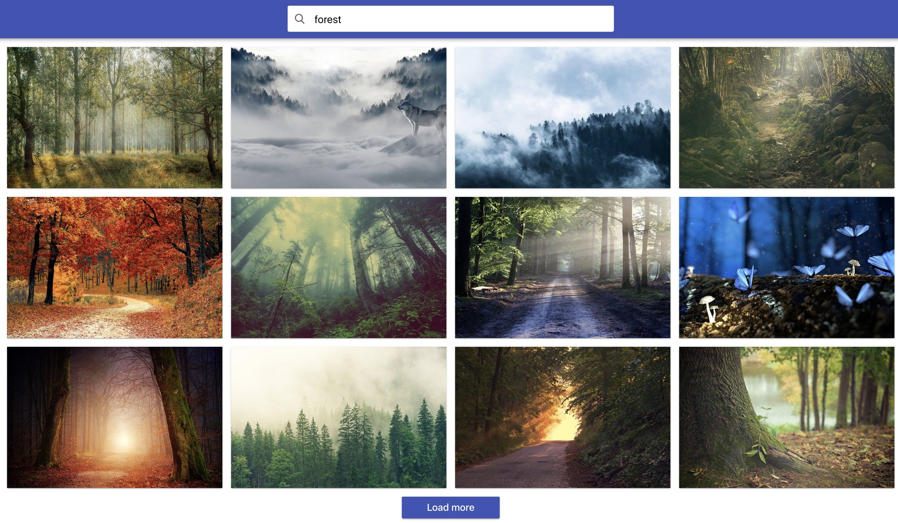

**Czytaj w innych językach [rosyjski](README.md), [ukraiński](README.ua.md).**

# Wyszukiwanie obrazów

Napisz aplikację wyszukiwania obrazów po słowie kluczu. Preview roboczej
aplikacji
[zobacz link](https://drive.google.com/file/d/1oXCGyiq4uKwW0zzraZLKk4lh3voBlBzZ/view?usp=sharing).

Stwórz komponenty `<Searchbar>`, `<ImageGallery>`, `<ImageGalleryItem>`,
`<Loader>`, `<Button>` i `<Modal>`. Gotowe style komponentów można znaleźć w
pliku [styles.css](./styles.css) i dostosować do siebie, jeśli jest to
potrzebne.



## Instrukcja Pixabay API

Dla zapytań HTTP wykorzystujących serwis wyszukiwania obrazów
[Pixabay](https://pixabay.com/api/docs/). Zarejestruj się i otrzymaj prywatny
kod dostępu.

Łańcuch URL zapytania HTTP.

```bash
https://pixabay.com/api/?q=cat&page=1&key=your_key&image_type=photo&orientation=horizontal&per_page=12
```

Pixabay API wspiera paginację, domyślnie parametr `page` równa się `1`. Niech w
odpowiedzi przychodzi po 12 obiektów umieszczonych w parametrze `per_page`. Nie
zapomnij, że podczas wyszukiwania po nowym słowie kluczu należy odrzucać wartość
`page` w `1`.

W odpowiedzi od api przychodzi tablica obiektów, wśród których interesują cię
wyłącznie następujące właściwości.

- `id` - unikalny identyfikator
- `webformatURL` - odnośnik do małego przedstawienia listy kart
- `largeImageURL` - odnośnik do dużego przedstawienia okna modalnego

## Opis komponentu `<Searchbar>`

Komponent przyjmuje jeden props `onSubmit` – funkcję do przekazywania wartości
inputu przy submicie formularza. Tworzy element DOM o następującej strukturze.

```html
<header class="searchbar">
  <form class="form">
    <button type="submit" class="button">
      <span class="button-label">Search</span>
    </button>

    <input
      class="input"
      type="text"
      autocomplete="off"
      autofocus
      placeholder="Search images and photos"
    />
  </form>
</header>
```

## Opis komponentu `<ImageGallery>`

Lista kart obrazków. Tworzy element DOM o następującej strukturze.

```html
<ul class="gallery">
  <!-- Zbiór <li> obrazów -->
</ul>
```

## Opis komponentu `<ImageGalleryItem>`

Komponent elementu listy z obrazem. Tworzy element DOM o następującej
strukturze.

```html
<li class="gallery-item">
  
</li>
```

## Opis komponentu `<Button>`

Po naciśnięciu przycisku `Load more` powinna ładować się następna porcja obrazów
i renderować się razem z poprzednimi. Przycisk powinien renderować się tylko
wtedy, gdy są jakieś załadowane obrazy. Jeśli tablica obrazów jest pusta,
przycisk nie renderuje się.

## Opis komponentu `<Loader>`

Komponent spinnera, pokaże się w trakcie ładowania obrazów. Wykorzystaj dowolny
gotowy komponent, na przykład
[react-loader-spinner](https://github.com/mhnpd/react-loader-spinner) lub inny
dowolny.

## Opis komponentu `<Modal>`

Po kliknięciu na element galerii powinno otwierać się okno modalne z ciemnym
overlay i wyświetlać się duża wersja obrazu. Okno modalne powinno zamykać się po
naciśnięciu klawisza `ESC` lub po kliknięciu na overlay.

Wygląd podobny jest do tej funkcjonalności
[VanillaJS-плагина](https://basiclightbox.electerious.com/), tylko zamiast
białego okna modalnego renderuje się obraz (na przykład kliknij `Run`). Nie
trzeba tworzyć animacji!

```html
<div class="overlay">
  <div class="modal">
    
  </div>
</div>
```
